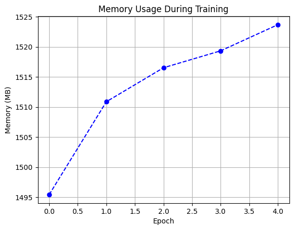
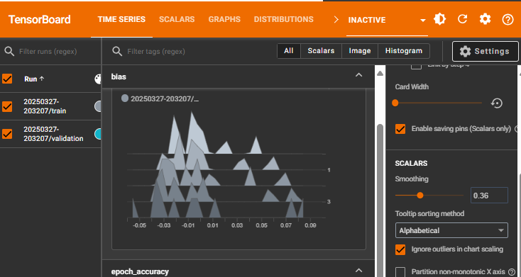
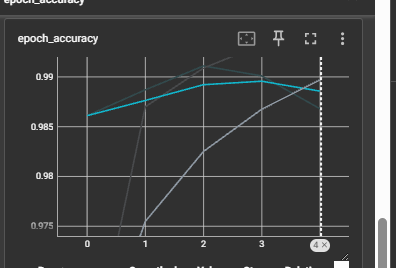

# Machine Learning Software Cost Optimization

This project focuses on optimizing the computational cost of machine learning (ML) workflows by profiling energy consumption, memory usage, and execution time using **CodeCarbon, TensorBoard Profiling, Memory Profiler, and SnakeViz**.


## Features
- **Carbon Emission Tracking**: Monitors energy consumption using `codecarbon`
- **Memory Profiling**: Tracks memory usage during model training
- **Performance Profiling**: Uses `cProfile` for function-level execution analysis
- **Visualization**: Generates real-time profiling insights with `snakeviz`
- **Colab Integration**: Supports GPU acceleration and one-click execution

## Installation
```sh
pip install codecarbon tensorboard-plugin-profile memory_profiler snakeviz
```

## 1. Environment Setup
```python
import tensorflow as tf
from tensorflow.keras import layers, models
import numpy as np
import matplotlib.pyplot as plt
from codecarbon import EmissionsTracker
from memory_profiler import memory_usage
import cProfile
import io
import pstats
```

### Verify GPU Availability
```python
print("GPU Available:", tf.config.list_physical_devices('GPU'))
```

## 2. Load CIFAR-10 Dataset
```python
(train_images, train_labels), (test_images, test_labels) = tf.keras.datasets.cifar10.load_data()
train_images, test_images = train_images / 255.0, test_images / 255.0
```

## 3. Define CNN Model
```python
def create_cnn_model():
    model = models.Sequential([
        layers.Conv2D(32, (3,3), activation='relu', input_shape=(32, 32, 3)),
        layers.MaxPooling2D((2,2)),
        layers.Conv2D(64, (3,3), activation='relu'),
        layers.MaxPooling2D((2,2)),
        layers.Conv2D(64, (3,3), activation='relu'),
        layers.Flatten(),
        layers.Dense(64, activation='relu'),
        layers.Dense(10)
    ])
    model.compile(optimizer='adam',
                  loss=tf.keras.losses.SparseCategoricalCrossentropy(from_logits=True),
                  metrics=['accuracy'])
    return model

model = create_cnn_model()
model.summary()
```

## 4. Training with Profiling
```python
def train_with_profiling():
    tracker = EmissionsTracker(log_level="error")
    tracker.start()
    mem_usage = []
    pr = cProfile.Profile()
    pr.enable()

    class MemoryCallback(tf.keras.callbacks.Callback):
        def on_epoch_end(self, epoch, logs=None):
            mem_usage.append(memory_usage(-1, interval=0.1)[0])

    history = model.fit(train_images, train_labels, epochs=10, validation_data=(test_images, test_labels),
                        callbacks=[MemoryCallback()])
    pr.disable()
    emissions = tracker.stop()

    s = io.StringIO()
    ps = pstats.Stats(pr, stream=s).sort_stats('cumulative')
    ps.print_stats()
    return history, emissions, mem_usage, s.getvalue()
```

### Execute Training
```python
history, emissions, mem_usage, profile_report = train_with_profiling()
```

## 5. Visualization
```python
plt.figure(figsize=(12, 4))
plt.subplot(1, 2, 1)
plt.plot(history.history['accuracy'], label='Training Accuracy')
plt.plot(history.history['val_accuracy'], label='Validation Accuracy')
plt.title('Accuracy Metrics')
plt.legend()

plt.subplot(1, 2, 2)
plt.plot(mem_usage, marker='o')
plt.title('Memory Usage During Training')
plt.ylabel('MB')
plt.xlabel('Epoch')
plt.tight_layout()
plt.show()
```

### Energy Report
```python
print(f"Total CO2 Emissions: {emissions} kg")
print(f"Average Memory Usage: {np.mean(mem_usage):.2f} MB")
```

## 6. Export Results
```python
model.save('cifar10_cnn.h5')
with open('energy_report.txt', 'w') as f:
    f.write(f"CO2 Emissions: {emissions} kg\n")
    f.write(f"Peak Memory Usage: {max(mem_usage)} MB\n")
    f.write("\nProfile Stats:\n")
    f.write(profile_report)
```

## 7. Advanced Profiling (Optional)
#### Monitor GPU/CPU Utilization
```sh
pip install nvitop
```
```python
from nvitop import Device
devices = Device.all()
for device in devices:
    print(f"{device.name}: {device.memory_used_human} used")
```

## 8. Colab Integration
1. **One-Click Execution**: Runs all cells sequentially
2. **Free GPU Acceleration**: Uses Colab's T4 GPU
3. **Persistent Storage**: Save models and reports to Google Drive
```python
from google.colab import drive
drive.mount('/content/drive')
```

## 9. Profiling in Action: Demo Screenshots





## 10. Contribution
If you’d like to contribute:
- Fork the repository
- Submit a pull request
- Share improvements on profiling & cost optimization

## 11. License
This project is released under the MIT License.

